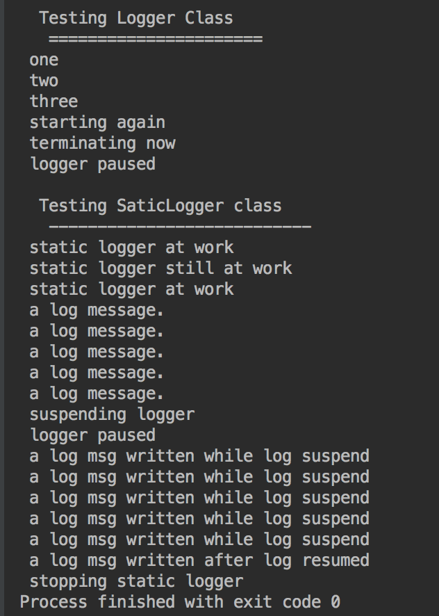

#An Effective Logging System
---

This is a simple logging system, is supports logging for multiple concurrent clients to a single std::ostream. It does this be enqueuing messages in a blocking queue and dequeuing with a single thread that writes to std::ostream.

Environment
---
Platform: MacOS, Linux

Require: CMake(I'm using V3.6)

Build && Run
---
```
cmake -H. -Bbuild
cmake --build build -- -j3

cd ./build
./AnEffectiveLoggerSystem
```
Or
Using **CLion** to build and run.

ScreenShot
---


LISENCE:
---
[BSD](http://opensource.org/licenses/BSD-2-Clause)

